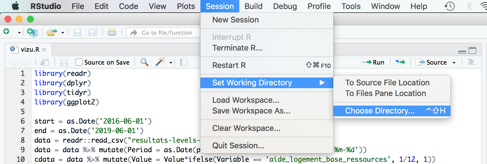

## 01-03/2018 - Supports du Groupe de Travail de lutte contre le non recours
  
 Supports du GT `Accès aux droits et aux services, lutte contre le non recours`  
 de la `Délégation Interministérielle à la prévention et à la lutte contre la pauvreté des enfants et des jeunes`.

 Le rapport de ce Groupe de Travail est accessible [ici](https://www.caissedesdepotsdesterritoires.fr/cs/BlobServer?blobkey=id&blobnocache=true&blobwhere=1250171076233&blobheader=application%2Fpdf&blobcol=urldata&blobtable=MungoBlobs).

### Description du contenu

* Le script `framework.py` exécute un ensemble de calculs de variables OpenFisca, d'après un ensemble de réformes sur les situations contenues dans `/situations`.  
Les resultats sont repertoriés dans un fichier `csv`.

* Le code `vizu.R` en langage [R](https://www.r-project.org) génère des courbes à partir des résultats `resultats-levels-.csv` du `framework.py`.


### Installation & exécution de `framework.py`

Le framework python fait appel à OpenFisca-France. Afin d'installer les librairies python dont il dépend, dans le répertoire `exemples/gt_non_recours/` exécuter :
```sh
make install
```
L'installation doit s'achever sans erreur.


Pour exécuter le framework, dans le répertoire `exemples/gt_non_recours/`, supprimer les résultats antérieurs et (re)démarrer le calcul avec les commandes suivantes :
```sh
make clean
make run
```
Le calcul doit s'achever sans erreur.
Un fichier `resultats-levels-.csv` contenant l'ensemble des valeurs demandées apparaît dans `exemples/gt_non_recours/`.

### Installation & exécution de `vizu.R`

Pour utiliser le code `vizu.R`, il faut avoir généré `resultats-levels-.csv` à partir de `framework.py` (voir description ci-dessus).

Les résultats OpenFisca présentés au GT comprennent des graphiques générés à partir de `vizu.R`. Celui-ci nécessite un environnement spécifique au langage [R](https://www.r-project.org) pour être exécuté :

1. Installer la version 3+ du langage R :  
Consulter [cran.rstudio.com](https://cran.rstudio.com), accéder au fichier à télécharger pour votre système d'exploitation et suivre les instructions associées.

    > Exemple pour MacOS :  
    A. Sur la [page d'accueil](https://cran.rstudio.com), cliquer sur `Download R for (Mac) OS X` pour accéder à la page d'instructions.  
    B. Sur la [page d'instructions](https://cran.rstudio.com/bin/macosx/), télécharger la dernière version 3 du langage R : fichier `R-3.x.x.pkg`  
    C. Double cliquer sur le fichier, puis, dans la fenêtre d'installation qui s'ouvre, suivre les instructions indiquées.


2. Installer [RStudio](https://www.rstudio.com/products/rstudio/download/#download) version `1.1.442` (ou autre version compatible avec R version 3).

3. Ouvrir l'application RStudio et, dans l'onglet `Console`, la version de code R prise en compte avec la commande `version` doit être en `3.x.x` :

    Par exemple, lors du GT, voici la configuration employée :
    ```R
    > version
                _
    platform       x86_64-apple-darwin13.4.0
    arch           x86_64
    os             darwin13.4.0
    system         x86_64, darwin13.4.0
    status
    major          3
    minor          3.1
    year           2016
    month          06
    day            21
    svn rev        70800
    language       R
    version.string R version 3.3.1 (2016-06-21)
    nickname       Bug in Your Hair
    ```

4. Dans RStudio, spécifier le répertoire de travail à partir duquel les chemins de fichiers seront calculés : dans le menu `Session`, choisir `Set Working Directory` > `Choose Directory...` et indiquer le répertoire `./exemples/gt_non_recours` où se trouve le code R `vizu.R`.

    

5. Ouvrir le fichier `vizu.R` et préciser son encodage en choisissant `UTF-8` dans le menu `File` > `Save with Encoding...`.

6. Installer les dépendances de `vizu.R` en entrant les instructions suivantes dans la `Console` :

    ```R
    install.packages('readr')
    install.packages('dplyr')
    install.packages('tidyr')
    install.packages('ggplot2')
    ```

6. Exécuter `vizu.R` en sélectionnant tout le contenu du fichier puis en cliquant sur le bouton `Run` (sur la barre d'en-tête du fichier).

7. Consulter le résultat du calcul sur l'onglet `Plots`.
